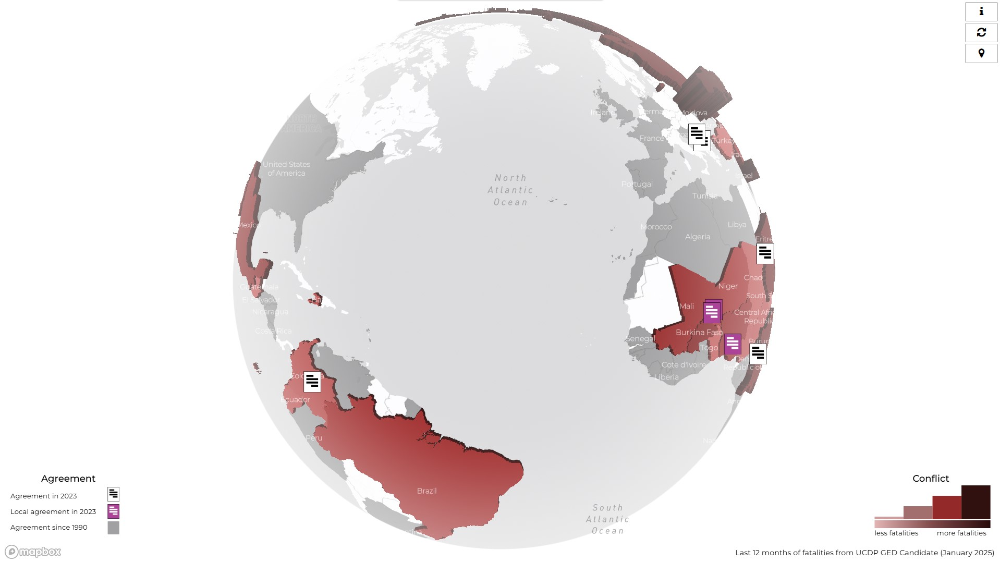

## Global Peace and Conflict 



This is a [`Svelte`] project scaffolded with [`Vite`]. It includes a deployment setup using [`gh-pages`] to publish the built site to GitHub Pages.

### Prerequisites

- [`Node.js`] 
- [`Yarn`] installed globally

### Installation

yarn install

### Development

yarn dev 

### Build

yarn build 

### Deployment

yarn deploy

### Monthly update

1. Replace 3 csv and 1 json file in public/data with monthly updates:
`agt_point_data.csv`, `country_data.csv`, `filled_polygon_data_5.csv`, `info_section.json`

2. Check if all is good with:
```bash
	yarn dev
```

3. Build: 
```bash
	yarn build
```

4. Deploy:
```bash
	yarn deploy
```

5. Git:
```bash
git add .
git commit -m "message"
git push
```